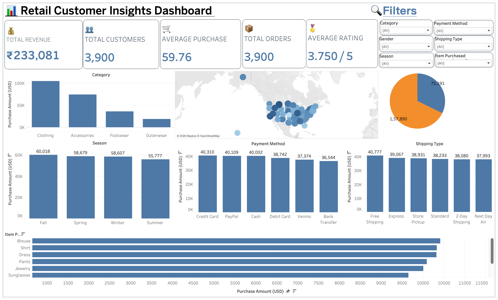

# 📊 Retail Customer Insights Dashboard

<p align="center">
  
</p>

<p align="center">


</p>

---

# 📌 Project Overview

This project presents an **interactive Retail Customer Insights Dashboard** built using **Tableau** to analyze customer purchasing behavior and retail sales trends.

The dashboard transforms raw transactional data into meaningful business insights through **interactive visualizations, KPI cards, filters, and geographic analysis**, enabling stakeholders to make informed business decisions.

This project demonstrates practical skills in:

- Business Intelligence
- Data Visualization
- Exploratory Data Analysis
- Dashboard Development
- Customer Analytics
- Retail Data Analysis

---

# 🎯 Business Problem

Retail companies generate thousands of customer transactions every day.

Without proper visualization and analytics, it becomes difficult to answer questions like:

- Which category generates the highest revenue?
- Which payment method is preferred?
- Which shipping method is most used?
- Which products sell the most?
- Which season performs best?
- Which locations generate the highest sales?
- How do customer demographics affect purchasing behavior?

This dashboard solves these problems by providing an interactive Business Intelligence solution.

---

# 🎥 Dashboard Demo

Watch a quick walkthrough of the dashboard demonstrating interactive filters, KPI cards, maps, and business insights.

> 📹 Demo Video


---

# 📈 Dashboard KPIs

| KPI | Value |
|------|-------|
| 💰 Total Revenue | ₹233,081 |
| 👥 Total Customers | 3,900 |
| 🛒 Total Orders | 3,900 |
| 💵 Average Purchase | 59.76 USD |
| ⭐ Average Rating | 3.75 / 5 |

---

# 📊 Dashboard Features

## ✅ Interactive Filters

- Category
- Gender
- Season
- Payment Method
- Shipping Type
- Item Purchased

---

## 📌 KPI Cards

- Total Revenue
- Total Customers
- Total Orders
- Average Purchase
- Average Rating

---

## 📊 Interactive Visualizations

- Category-wise Revenue
- Seasonal Sales Analysis
- Payment Method Analysis
- Shipping Type Distribution
- Item Purchased Analysis
- Geographic Customer Distribution
- Revenue Distribution

---

# 🛠 Tech Stack

| Tool | Purpose |
|------|----------|
| Tableau | Dashboard Development |
| Python (Pandas) | Data Cleaning & Analysis |
| CSV Dataset | Data Source |
| GitHub | Version Control |

---

# 💡 Skills Demonstrated

- Data Cleaning
- Exploratory Data Analysis (EDA)
- Business Intelligence
- Data Visualization
- Dashboard Design
- KPI Development
- Customer Analytics
- Retail Analytics
- Geographic Visualization
- Data Storytelling

---

# 📂 Repository Structure

```
Retail-Customer-Insights-Dashboard
│
├── Dashboard
│   └── Retail_Customer_Insights_Dashboard.twbx
│
├── Dataset
│   └── customer_shopping_behavior.csv
│
├── Documentation
│   ├── Business Problem Document.pdf
│   ├── Customer_Shopping_Behavior_Analysis.ipynb
│   └── Customer-Shopping-Behavior-Analysis.pdf
│
├── Images
│   └── dashboard.png
│
├── LICENSE
└── README.md
```

---

# 🖼 Dashboard Preview

<p align="center">


</p>

---

# 🔍 Key Business Insights

## 👕 Highest Revenue Category

- Clothing contributes the highest purchase amount among all product categories.

---

## 💳 Payment Preferences

- Credit Card and PayPal are among the most frequently used payment methods.

---

## 🍂 Seasonal Trends

- Fall season generates the highest revenue.

---

## 🚚 Shipping Analysis

- Free Shipping is the most preferred shipping option.

---

## 🌍 Geographic Distribution

- Customer purchases are distributed across multiple states.

---

## 🛍 Product Insights

- Shirts and Blouses are among the highest-selling products.

---

# 📄 Project Documentation

The repository also includes:

- 📑 Business Problem Document
- 📓 Python Data Analysis Notebook
- 📕 Project Report (PDF)
- 📊 Tableau Dashboard

---

# 🚀 How to Use

### Clone the repository

```bash
git clone https://github.com/AnubhavRathore09/Retail-Customer-Insights-Dashboard.git
```

Open

```
Dashboard/
└── Retail_Customer_Insights_Dashboard.twbx
```

using **Tableau Desktop** or **Tableau Public**.

You can also explore the dataset using the provided Python notebook.

---

# 📈 Future Improvements

- Customer Segmentation
- RFM Analysis
- Customer Lifetime Value (CLV)
- Predictive Sales Forecasting
- Profit Dashboard
- Tableau Story Dashboard
- Customer Recommendation Analysis

---

# 👨‍💻 Author

### Anubhav Rathore

📧 **Email**

anubhavsrathore@gmail.com

🔗 **GitHub**

https://github.com/AnubhavRathore09

🔗 **LinkedIn**

https://www.linkedin.com/in/anubhav-rathore09/

---

# ⭐ Support

If you found this project useful,

⭐ **Give it a Star**

It helps the project reach more developers and motivates future work.

---

## 📜 License

This project is licensed under the **MIT License**.
